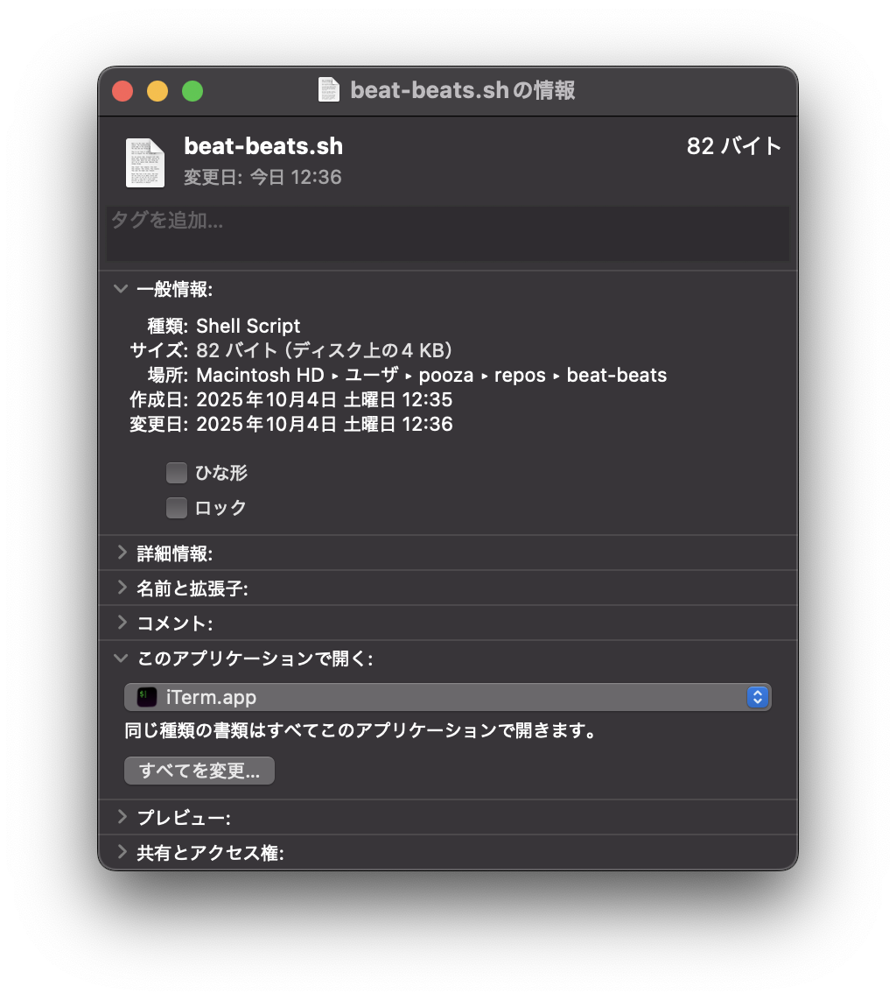

# beet-beats

macOS Music.app から現在再生中の曲情報を取得し、

- ナウプレ文面をクリップボードにコピー。
- アートワーク（カバーアート）を PNG としてデスクトップに保存。
  - 保存先は `ダウンロード` フォルダではなくデスクトップです。

するシンプルな AppleScript ツールです。

🍠🎶 名前の由来: **Beet (野菜のビーツ) + Beats (音楽のビート)**

## 使い方

### ターミナルから実行する

```bash
git clone https://github.com/pooza/beet-beats.git
cd beet-beats
./beat-beats.sh
```

### アプリケーションとして実行する（確認中）

`ファイルのアクセス権の誤りが起きました。（-54）` というエラーが起きます。

1. スクリプトエディタで `beet-beats.applescript` を開く。
2. メニューの **「ファイル > 書き出す…」** を選び、形式を **「アプリケーション」** にして保存。
3. 保存したアプリを実行すると、
   - 再生中の曲情報 (Title/Album/Artist) がクリップボードにコピーされます。
   - カバーアートが PNG 形式でデスクトップに保存されます。

## 動作環境

- macOS Sonoma (14) 以降を推奨。
- macOS Ventura (13) でも動作する可能性はありますが、サポート対象外です（自己責任）。
- 初回実行時に「ミュージックを操作してよいか」の許可ダイアログが表示されることがあります。

## おまけ

### エイリアスをつくる

- beat-beats.sh のエイリアスをデスクトップ等に作成するのもお勧めです。
- その場合は、拡張子 `.sh` の「このアプリケーションで開く」に、 `ターミナル.app` や `iTerm.app` を指定します。
  - この指定の結果、実行時にターミナルが開きます。



### アイコンを変える

デフォルトでは味気ないアイコンが付きます。
好きな画像を使って差し替えることが可能です。

1. Finder で保存したアプリを右クリック → **「情報を見る」** を選択。
2. 使いたい画像をプレビューで開き、**⌘C** でコピー。
3. 「情報を見る」ウィンドウ左上のアイコンをクリックして選択状態にし、**⌘V** でペースト。

このリポジトリには `beet.png` を同梱しているので、お好みでどうぞ。
気に入らなければ同じ手順で元に戻せます。

## ライセンス

- 自由に改造・配布してください。
  - 実はこのREADMEを含めたほとんどの要素を、ChatGPTに作成させています。
- ただし署名・公証は行っていないため、配布した `.app` は Gatekeeper に警告されます。
- 利用者自身がスクリプトエディタでアプリ化すれば、警告なしで利用できます。
